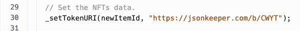
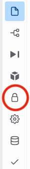
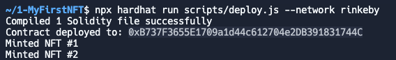

# 💃 MyAwesomeGirlFriend NFT
>*Have you ever fallen in love so deeply that you want to shout it out to the world? Well, then it's probably time to make an NFT of your significant other...*

## 🦊 MINT YOUR FIRST NFT
### 💎 Create a contract that mints NFTs
#### 🌊 View on OpenSea
1. 🛫 upload an image or peace of art (e.g. on [imgur.com](https://imgur.com)) and copy the `url` to your image.
2. ✍️ create your NFTs metadata with the image url from 1️⃣ and 🛫 post it *hasselfree* on [jsonkeeper](https://jsonkeeper.com/). *(Don't forget to copy the `url to your metadata`)*:
```
{
    "name": "My epic girl friend",
    "description": "The whole wide world should know about the woman I love!!!",
    "image": "https://i.imgur.com/w4sEx60.png"
}
``` 
3. Paste that url into `MyEpicNFT.sol`contract (line 30):
  
4. Add your 🦊 `Metamask private key` for your rinkeby testnet into the `Secrets` menu on the left panel:  

1. 👩🏾‍💻 type `npx hardhat run scripts/deploy.js --network rinkeby` and voilà - your NFT is deployed:


>*You can grab your deployment address and search for it on [opensea.io](testnets.opensea.io) or see [here](https://testnets.opensea.io/collection/squarenft-dhd7hreajl) or here:*


#### 😱 *IF your NFT does not show up ...*
OpenSea is sometimes a bit *picky*. If your NFT does not show up try  **Rarible** instead. 
It's another NFT marketplace similar to OpenSea. It also has a Rinkeby testnet.  
👉🏻 Got to [Rarible](https://rinkeby.rarible.com/) and paste your deployment address (as you did in Opensea). That's it!


---  
>🕺💃🎉 *That's it for the beginning! Clab yourself on the back: you minted your first NFT! Congratulations!* 🥳

*In the next mini-course we will mint a NFT on-chain, i.e. image and metadata on the blockchain ...*