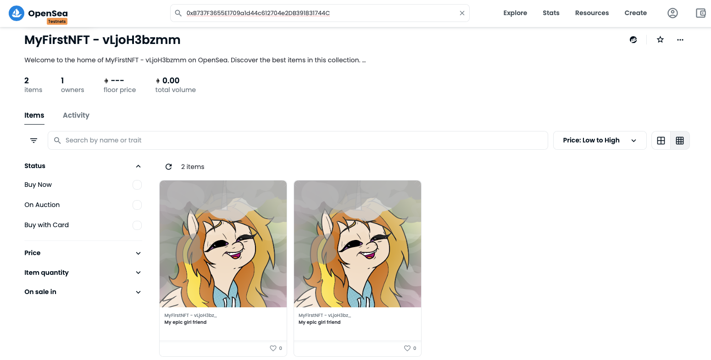
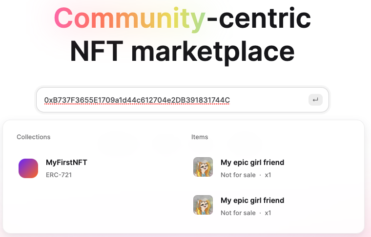

# Hello UnpackAI Student 😃 👩🏻‍🎓👨‍🎓

> - Please follow the instructions in our **NFT-Workbook** from **week 1**.  
> - You should have pasted the code into /contracts/MyEpicNFT.sol
> - And inserted your (or UnpackAIs) 🦊 Metamask Rinkeby private key

   *When your ready ...*

---
> # 🧨 PRESS Run 🚀   
---
*if run does not work type: `npx hardhat run scripts/deploy.js --network rinkeby` into shell*

#### 🌊 View on OpenSea   
>*You can grab your deployment address and search for it on [opensea.io](testnets.opensea.io) or see [here](https://testnets.opensea.io/collection/squarenft-dhd7hreajl) or here:*

#### 😱 *IF your NFT does not show up ...*
OpenSea is sometimes a bit *picky*. If your NFT does not show up try  **Rarible** instead. 
It's another NFT marketplace similar to OpenSea. It also has a Rinkeby testnet.  
👉🏻 Got to [Rarible](https://rinkeby.rarible.com/) and paste your deployment address (as you did in Opensea). That's it!

---  
>🕺💃🎉 *That's it for the beginning! Clab yourself on the back: you minted your first NFT! Congratulations!* 🥳 **Why don't copy the link to your NFT in our Wechat Group?** *We would love to see your freshly minted NFT?* 😍

*In the next mini-course we will mint a NFT on-chain, i.e. image and metadata are stored in the contract on
the blockchain. Please return to the workbook to Assignment 1b ...*